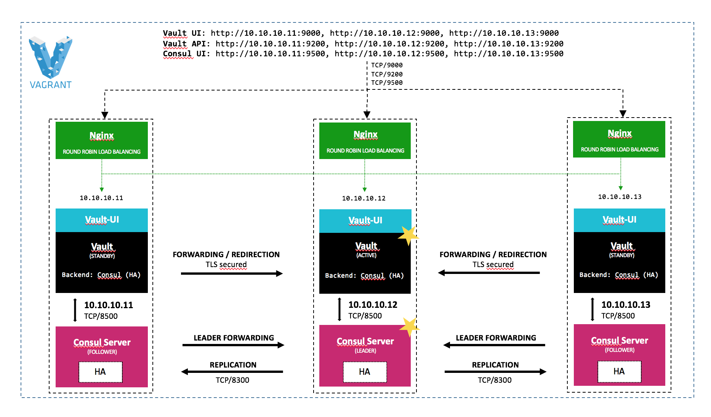

# HA Vault cluster with Consul backend based on Docker

This assumes you have [Vagrant](https://www.vagrantup.com/) installed and working. Beyond please install these Vagrant plugins with  ```vagrant plugin install <plugin>```:

- vai
- vagrant-cachier
- vagrant-vbguest

#### About this repository

This setup implements a highly available (HA) Vault cluster with Consul storage backend. There are many [more backends](https://www.vaultproject.io/docs/configuration/storage/index.html), each with pros, cons, advantages, and trade-offs. For example, some backends support high availability (Consul does) while others provide a more robust backup and restoration process. As Consul (like Vault) is a HashiCorp tool, I assume these two play together very well.

A Nginx proxy serves as a load balancer in front of Vault. Vault API is accessible by port _TCP/9000_. Vault UI is accessible by port _TCP/9200_. Consul UI is accessible by port _TCP/9500_. For convenience, everything is HTTP-only.

That being a simplified setup, all native Vault and Consul ports (TCP/8200, TCP/8500) are directly accessible, too. In a real world scenario, all three VMs would be in a private network with controlled access.



Let's go!

#### Clone repository

```bash
git clone https://github.com/consort-it/ha-vault-with-consul.git
```

#### Start Vault cluster

```bash
cd ha-vault-with-consul

vagrant up --provision
```

#### Initialize and unseal Vault

Because of Vault's unsealing process, __every__ single Vault node needs to be unsealed. This is a very manual process.

```bash
vagrant ssh vault01

curl -X PUT -d "{\"secret_shares\":1, \"secret_threshold\":1}" http://127.0.0.1:8200/v1/sys/init | tee vault-init

export VAULT_UNSEAL_KEY=$(cat vault-init | grep -oEi "\"keys_base64\":\[\"(.*)\"\]" | grep -oEi "\[\"(\S*)\"\]" | sed 's/\["//g' | sed 's/"\]//g')
export VAULT_TOKEN=$(cat vault-init | grep -oEi "\"root_token\":\"(.*)\"" | grep -oEi ":\"(\S*)\"" | sed 's/://g' | sed 's/\"//g')

curl -X PUT -d "{\"key\": \"$VAULT_UNSEAL_KEY\"}" http://127.0.0.1:8200/v1/sys/unseal
curl -X PUT -d "{\"key\": \"$VAULT_UNSEAL_KEY\"}" http://10.10.10.12:8200/v1/sys/unseal
curl -X PUT -d "{\"key\": \"$VAULT_UNSEAL_KEY\"}" http://10.10.10.13:8200/v1/sys/unseal

exit
```

#### Insert test data

```bash
vagrant ssh vault01

export VAULT_TOKEN=$(cat vault-init | grep -oEi "\"root_token\":\"(.*)\"" | grep -oEi ":\"(\S*)\"" | sed 's/://g' | sed 's/\"//g')

curl -X POST -H "X-Vault-Token:$VAULT_TOKEN" -d '{"bar":"baz"}' http://127.0.0.1:8200/v1/secret/foo

echo $VAULT_TOKEN

exit
```

#### Do some testing

Open a shell on your host without entering any Vagrant box. For better readability make sure that _jq_ is installed on your system. Though, all commands will work without it, too. Just cut it.

```bash
export VAULT_TOKEN=<insert vault token from above echo command>
```

We've just added our foo test secret on vault01 VM. So let's ask vault03 if it knows our secret.

```bash
curl -s -X GET -H "X-Vault-Token:$VAULT_TOKEN" http://10.10.10.13:9200/v1/secret/foo | jq .
```
Yeah:

```bash
{
  "request_id": "b7680176-44eb-5988-f2fd-7df68ea46b3e",
  "lease_id": "",
  "renewable": false,
  "lease_duration": 2764800,
  "data": {
    "bar": "baz"
  },
  "wrap_info": null,
  "warnings": null,
  "auth": null
}
```

Let's see if vault02 knows it, too:

```bash
curl -s -X GET -H "X-Vault-Token:$VAULT_TOKEN" http://10.10.10.12:9200/v1/secret/foo | jq .
```
Yeah again:

```bash
{
  "request_id": "03a6c177-1f9c-117d-17fd-acdadf6d938a",
  "lease_id": "",
  "renewable": false,
  "lease_duration": 2764800,
  "data": {
    "bar": "baz"
  },
  "wrap_info": null,
  "warnings": null,
  "auth": null
}
```

Now let's do some HA testing. Open another shell, enter vault01 and monitor our cluster:

```bash
vagrant ssh vault01

watch -n0.5 --color /usr/local/bin/check-vault.sh
```

Open another shell on your host and poweroff vault02:

```bash
cd ha-vault-with-consul

vagrant halt vault02
```

```bash
Address                 Seal Status     Health          Leader
10.10.10.11:8200        unsealed        passing         *
10.10.10.12:8200        sealed          critical
10.10.10.13:8200        unsealed        passing

OK: Service 'vault' is functioning correctly.
```

Let's check if there is our foo secret somewhere:

```bash
curl -s -X GET -H "X-Vault-Token:$VAULT_TOKEN" http://10.10.10.13:9200/v1/secret/foo | jq .
```

Nice:

```bash
{
  "request_id": "fc5e85b5-c233-c422-87fd-72865112c08f",
  "lease_id": "",
  "renewable": false,
  "lease_duration": 2764800,
  "data": {
    "bar": "baz"
  },
  "wrap_info": null,
  "warnings": null,
  "auth": null
}
```

Finally let's check if our cluster recovers if vault02 comes back:

```bash
vagrant up vault02
```

Of course you need to unseal manually:

```bash
vagrant ssh vault01

export VAULT_UNSEAL_KEY=$(cat vault-init | grep -oEi "\"keys_base64\":\[\"(.*)\"\]" | grep -oEi "\[\"(\S*)\"\]" | sed 's/\["//g' | sed 's/"\]//g')

curl -X PUT -d "{\"key\": \"$VAULT_UNSEAL_KEY\"}" http://10.10.10.12:8200/v1/sys/unseal

exit
```

Et voilà:

```bash
Address                 Seal Status     Health          Leader
10.10.10.11:8200        unsealed        passing         *
10.10.10.12:8200        unsealed        passing
10.10.10.13:8200        unsealed        passing

OK: Service 'vault' is functioning correctly.
```

#### Cleanup

```bash
vagrant destroy -f
```
